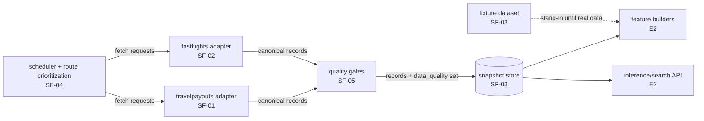

# E1 — Data Pipeline

**Importance:** 10/10. Nothing else in Snap Flights works without this.
**Status:** specced in depth. Subfeatures SF-01…SF-05.
**Depends on:** L0 foundation. Blocked on open decisions D1, D4 (see L0 §8) before code starts.

---

## Goal

Collect flight prices from multiple sources every day, normalize them to one schema,
check them, and append them to an immutable time-series store that models and the API
read from. Build it so adding or dropping a source is a contained change.

The pipeline's job is **accumulating our own price history** — the dataset nobody sells.
Correctness and continuity matter more than volume.

---

## Non-goals (for this epic)

- Prediction, scoring, buy-vs-wait logic — that's E2.
- Any UI — that's E2/E3.
- Booking, deep links, OTA ratings — E6.
- Flight status / position / delay data — separate path, feeds E7, not this schema.
- Real-time / sub-minute freshness. Daily cadence per route tier is the target.
- Paid sources. Duffel and airline-direct adapters are designed-for, not built now.

---

## Shape

Flow: the **scheduler** decides which routes/date-windows to fetch this run and calls the
**adapters**. Each adapter returns canonical records + an outcome. The scheduler passes
records through the **quality gates**, which stamp `data_quality`. The scheduler writes the
result to the **snapshot store** with a shared `ingest_run_id`. Partial/rate-limited
fetches get re-queued.

---

## Subfeatures

| ID | Title | Depends on | One-line |
|----|-------|-----------|----------|
| SF-03 | Canonical schema + snapshot store | — | The schema module, the store read/write, the committed fixture dataset. **Do this first.** |
| SF-01 | Travelpayouts source adapter | SF-03 | Free affiliate API → `calendar_cheapest` records. The backbone. |
| SF-02 | fast-flights source adapter | SF-03 | Open-source Google Flights scraper → `itinerary` records. Sparingly used, degrades gracefully. |
| SF-04 | Collection scheduler + route prioritization | SF-03, one adapter | Route tiers, per-tier cadence, fetch-request generation, re-queue of partial fetches, `ingest_run_id`. |
| SF-05 | Data-quality gates | SF-03 | Sanity checks that stamp `ok`/`suspect`/`rejected` + `quality_flags`. Fail loudly on run-level anomalies. |

## Build order

1. **SF-03** — unblocks everyone. Includes the fixture dataset, so SF-06/07/08 can start in parallel right after.
2. **SF-01** and **SF-05** in parallel (different files).
3. **SF-02** in parallel with SF-01 (different adapter dir).
4. **SF-04** once SF-03 + at least one adapter + SF-05 exist.

## Later additions to this epic (not specced now)

- Duffel adapter (paid; adapter interface already fits it).
- Airline-direct adapters (Ryanair, Wizz, Southwest) for budget-carrier coverage (E4 dependency).
- Backfill tooling (re-fetch a route/date range after a gap).
- Snapshot-store compaction / retention policy once volume is real.
- A proper orchestrator if cron gets painful (open decision D5).

## Done when (epic-level)

- A single command runs one collection pass end to end against the real sources and
  appends schema-valid, quality-stamped records to `data/snapshots/`.
- The same command runs against a mock/fixture source in CI with no network.
- Re-running a pass does not create duplicate observations.
- A run that returns anomalous data (empty, all-suspect, price collapse) surfaces loudly
  instead of silently polluting the store.
- `models/` and `api/` can read fare history through the store interface alone, with the
  fixture dataset standing in until real history accumulates.
